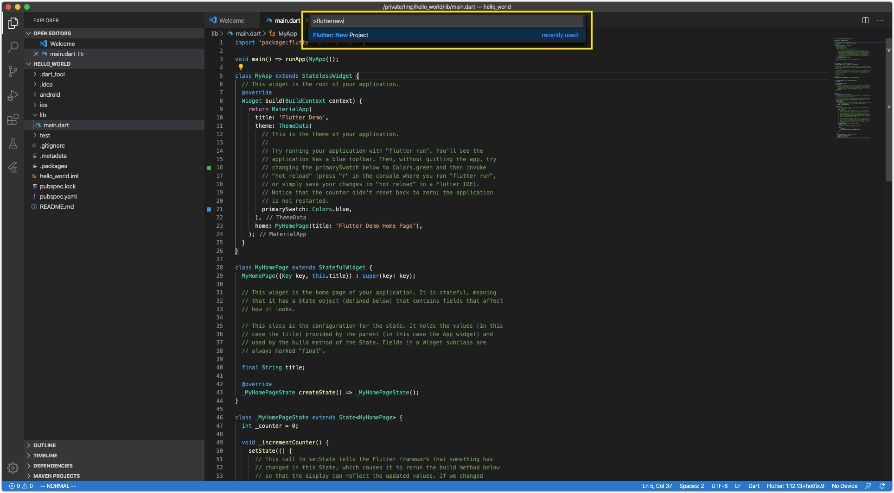
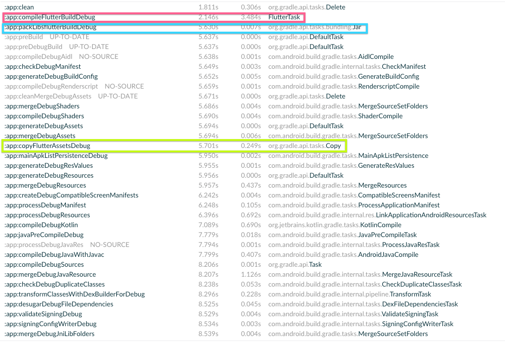
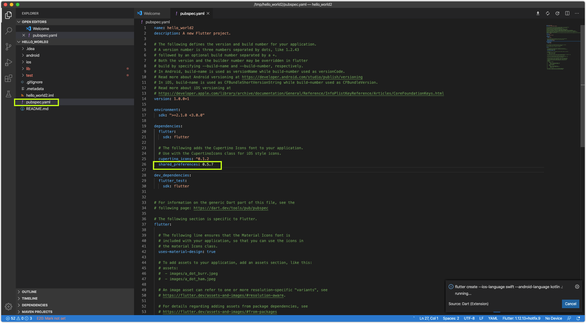
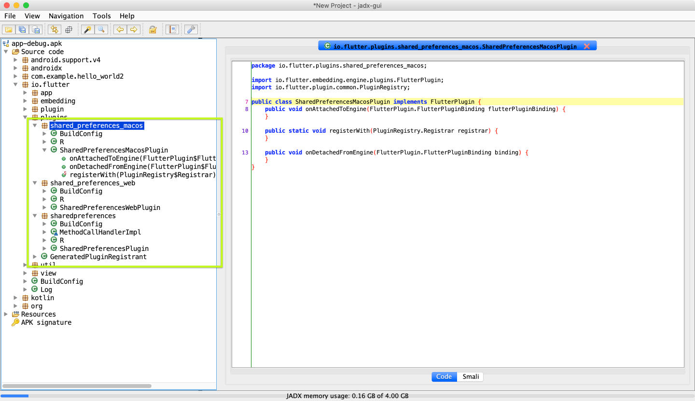

# 1. flutter android工程构建剖析一

# 备注

文章包含图片，如果图片无法显示，请搜索如何解决。

# 准备工作

使用`VS Code`创建一个最简单的`hello_world`工程：



# 分析

看生成的`hello_world`工程由很多个文件和目录：

	hello_world
	├── README.md
	├── android
	├── hello_world.iml
	├── ios
	├── lib
	├── pubspec.lock
	├── pubspec.yaml
	└── test

我们**主要看android目录**：

	hello_world
	├── README.md
	├── android
	│   ├── app
	│   │   ├── build.gradle
	│   │   └── src
	│   │       ├── debug
	│   │       │   └── AndroidManifest.xml
	│   │       ├── main
	│   │       │   ├── AndroidManifest.xml
	│   │       │   ├── java
	│   │       │   │   └── io
	│   │       │   │       └── flutter
	│   │       │   │           └── plugins
	│   │       │   │               └── GeneratedPluginRegistrant.java
	│   │       │   ├── kotlin
	│   │       │   │   └── com
	│   │       │   │       └── example
	│   │       │   │           └── hello_world
	│   │       │   │               └── MainActivity.kt
	│   │       │   └── res
	│   │       │       ├── drawable
	│   │       │       │   └── launch_background.xml
	│   │       │       ├── mipmap-hdpi
	│   │       │       │   └── ic_launcher.png
	│   │       │       ├── mipmap-mdpi
	│   │       │       │   └── ic_launcher.png
	│   │       │       ├── mipmap-xhdpi
	│   │       │       │   └── ic_launcher.png
	│   │       │       ├── mipmap-xxhdpi
	│   │       │       │   └── ic_launcher.png
	│   │       │       ├── mipmap-xxxhdpi
	│   │       │       │   └── ic_launcher.png
	│   │       │       └── values
	│   │       │           └── styles.xml
	│   │       └── profile
	│   │           └── AndroidManifest.xml
	│   ├── build.gradle
	│   ├── gradle
	│   │   └── wrapper
	│   │       ├── gradle-wrapper.jar
	│   │       └── gradle-wrapper.properties
	│   ├── gradle.properties
	│   ├── gradlew
	│   ├── gradlew.bat
	│   ├── hello_world_android.iml
	│   ├── local.properties
	│   └── settings.gradle	
	
## 1. 要分析android工程构建流程，首先我们就要看一下**根工程**的`build.gradle`文件：

	hello_world
	├── README.md
	├── android
	│   ├── app
	│   │   ├── build.gradle // app工程的build.gradle
        │   ├── build.gradle // 根工程的build.gradle
	hello_world/android

看一下内容：

```groovy
buildscript {
    ext.kotlin_version = '1.3.50'
    repositories {
        google()
        jcenter()
    }

    dependencies {
        classpath 'com.android.tools.build:gradle:3.5.0'
        classpath "org.jetbrains.kotlin:kotlin-gradle-plugin:$kotlin_version"
    }
}

allprojects {
    repositories {
        google()
        jcenter()
    }
}

rootProject.buildDir = '../build'
subprojects {
    project.buildDir = "${rootProject.buildDir}/${project.name}"
}
subprojects {
    project.evaluationDependsOn(':app')
}

task clean(type: Delete) {
    delete rootProject.buildDir
}
```

### 1.1 和普通android工程一样添加了`android gradle 插件`和`kotlin gradle 插件`依赖，**没有添加额外的插件**：

```groovy
dependencies {
    classpath 'com.android.tools.build:gradle:3.5.0'
    classpath "org.jetbrains.kotlin:kotlin-gradle-plugin:$kotlin_version"
}
```

### 1.2 把编译的临时目录都改到`flutter`工程根目录的`build`目录下：

```groovy
rootProject.buildDir = '../build'
subprojects {
    project.buildDir = "${rootProject.buildDir}/${project.name}"
}
subprojects {
    project.evaluationDependsOn(':app')
}
```

让我们注释掉以上代码执行一下编译，我们看到都会在当前工程下创建一个`build`目录作为编译的临时产物目录：

	hello_world
	├── README.md
	├── android
	│   ├── app
	│   │   ├── build // <-app工程的build目录
	│   │   ├── build.gradle
	│   │   └── src
	│   ├── build // 根工程的build目录
	│   │   └── kotlin
	│   ├── build.gradle
	│   ├── gradle
	│   │   └── wrapper
	│   ├── gradle.properties
	│   ├── gradlew
	│   ├── gradlew.bat
	│   ├── hello_world_android.iml
	│   ├── local.properties
	│   └── settings.gradle

但是通过以上代码，把所有工程的中间目录都给统一到了`flutter`工程根目录的`build`目录下，最后目录结构如下：

	hello_world
	├── README.md
	├── android
	│   ├── app
	│   │   ├── build // <-没有了app工程的build目录
	│   │   ├── build.gradle
	│   │   └── src
	│   ├── build // 没有了根工程的build目录
	│   │   └── kotlin
	│   ├── build.gradle
	│   ├── gradle
	│   │   └── wrapper
	│   ├── gradle.properties
	│   ├── gradlew
	│   ├── gradlew.bat
	│   ├── hello_world_android.iml
	│   ├── local.properties
	│   └── settings.gradle
	├── build // 根工程的build目录
	│   ├── app // <-app工程的build目录
	│   │   ├── generated
	│   │   ├── intermediates
	│   │   ├── kotlin
	│   │   ├── outputs
	│   │   └── tmp
	│   └── kotlin
	│       └── sessions

# 2. 看完根工程的`build.gradle`，然后我们看一下`app`工程下面的`build.gradle`

	hello_world
	├── README.md
	├── android
	│   ├── app
	│   │   ├── build.gradle // <-这个文件
	
内容如下：

```groovy
def localProperties = new Properties()
def localPropertiesFile = rootProject.file('local.properties')
if (localPropertiesFile.exists()) {
    localPropertiesFile.withReader('UTF-8') { reader ->
        localProperties.load(reader)
    }
}

def flutterRoot = localProperties.getProperty('flutter.sdk')
if (flutterRoot == null) {
    throw new GradleException("Flutter SDK not found. Define location with flutter.sdk in the local.properties file.")
}

def flutterVersionCode = localProperties.getProperty('flutter.versionCode')
if (flutterVersionCode == null) {
    flutterVersionCode = '1'
}

def flutterVersionName = localProperties.getProperty('flutter.versionName')
if (flutterVersionName == null) {
    flutterVersionName = '1.0'
}

apply plugin: 'com.android.application'
apply plugin: 'kotlin-android'
apply from: "$flutterRoot/packages/flutter_tools/gradle/flutter.gradle"

android {
    compileSdkVersion 28

    sourceSets {
        main.java.srcDirs += 'src/main/kotlin'
    }

    lintOptions {
        disable 'InvalidPackage'
    }

    defaultConfig {
        // TODO: Specify your own unique Application ID (https://developer.android.com/studio/build/application-id.html).
        applicationId "com.example.hello_world"
        minSdkVersion 16
        targetSdkVersion 28
        versionCode flutterVersionCode.toInteger()
        versionName flutterVersionName
        testInstrumentationRunner "androidx.test.runner.AndroidJUnitRunner"
    }

    buildTypes {
        release {
            // TODO: Add your own signing config for the release build.
            // Signing with the debug keys for now, so `flutter run --release` works.
            signingConfig signingConfigs.debug
        }
    }
}

flutter {
    source '../..'
}

dependencies {
    implementation "org.jetbrains.kotlin:kotlin-stdlib-jdk7:$kotlin_version"
    testImplementation 'junit:junit:4.12'
    androidTestImplementation 'androidx.test:runner:1.1.1'
    androidTestImplementation 'androidx.test.espresso:espresso-core:3.1.1'
}
```

## 2.1 读取根工程的`local.properties`文件，在生成flutter工程的时候，会生成一个`local.properties`文件，位置如下：

	hello_world
	├── README.md
	├── android
	│   ├── app
	│   │   ├── build.gradle
	│   │   └── src
	│   ├── build.gradle
	│   ├── gradle
	│   │   └── wrapper
	│   ├── gradle.properties
	│   ├── gradlew
	│   ├── gradlew.bat
	│   ├── hello_world_android.iml
	│   ├── local.properties // <-生成的local.properties文件，在android目录下
	│   └── settings.gradle

内容如下：

	sdk.dir=/Users/hjohnchen/Library/Android/sdk/
	flutter.sdk=/usr/local/Caskroom/flutter/latest/flutter
	flutter.buildMode=debug
	flutter.versionName=1.0.0
	flutter.versionCode=1
	
其中`flutter.versionName`和`flutter.versionCode`定义`App`的版本号：

```groovy
def flutterVersionCode = localProperties.getProperty('flutter.versionCode')
if (flutterVersionCode == null) {
    flutterVersionCode = '1'
}

def flutterVersionName = localProperties.getProperty('flutter.versionName')
if (flutterVersionName == null) {
    flutterVersionName = '1.0'
}

android {
    ……

    defaultConfig {
        // TODO: Specify your own unique Application ID (https://developer.android.com/studio/build/application-id.html).
        applicationId "com.example.hello_world"
        minSdkVersion 16
        targetSdkVersion 28
        versionCode flutterVersionCode.toInteger() // flutter.versionCode
        versionName flutterVersionName // flutter.versionName
        testInstrumentationRunner "androidx.test.runner.AndroidJUnitRunner"
    }

    ……
}
```

### `flutter.sdk`是比较重要的一个变量，他用来获取`flutter`打包插件脚本的位置的，以下几段代码就是他和普通Android工程不一样的地方：

```groovy
def flutterRoot = localProperties.getProperty('flutter.sdk') // flutter.sdk=/usr/local/Caskroom/flutter/latest/flutter
if (flutterRoot == null) {
    throw new GradleException("Flutter SDK not found. Define location with flutter.sdk in the local.properties file.")
}
……
apply from: "$flutterRoot/packages/flutter_tools/gradle/flutter.gradle"

……
flutter {
    source '../..'
}
```

## 2.2 `apply from: "$flutterRoot/packages/flutter_tools/gradle/flutter.gradle"`

整体`flutter`打包脚本的核心就是这个文件，也是普通Android App工程和`flutter`Android 工程打包脚本的唯一关键差异性。

根据`local.properties`里面定义的

	flutter.sdk=/usr/local/Caskroom/flutter/latest/flutter

替换`$flutterRoot`变量整个文件路径就是

	/usr/local/Caskroom/flutter/latest/flutter/packages/flutter_tools/gradle/flutter.gradle

这个文件也可以从这里看：[https://github.com/flutter/flutter/blob/master/packages/flutter_tools/gradle/flutter.gradle](https://github.com/flutter/flutter/blob/master/packages/flutter_tools/gradle/flutter.gradle)

接下来我们看一下内容：

# 代码应用了一个`flutter`打包插件：`apply plugin: FlutterPlugin`

```groovy
apply plugin: FlutterPlugin

class FlutterPlugin implements Plugin<Project> {
```

我们知道一个gradle Plugin的入口是`apply`函数：

```groovy
@Override
void apply(Project project) {
    this.project = project
```
让我们分解一下`apply`函数：

## 1. 配置`flutter`扩展配置

```groovy
class FlutterPlugin implements Plugin<Project> {
    @Override
    void apply(Project project) {
        this.project = project

        project.extensions.create("flutter", FlutterExtension) // 配置flutter扩展配置
	……
    }
……
}

class FlutterExtension {
    String source
    String target
}
```

前面我们看`app`工程下面的`build.gradle`代码有这一段，给`FlutterExtension`配置了一个`source`：

```groovy
flutter {
    source '../..'
}
```

配置了`FlutterExtension`的`source`属性，后面可以通过`project.flutter.source`这么来获取上面赋值的`source`值`'../..'`：

```groovy
if (project.flutter.source == null) { // project.flutter.source = '../..'
    throw new GradleException("Must provide Flutter source directory")
}
```

## 2. 如果是编译apk，apk是否根据不同的CPU来进行分包：

```groovy
class FlutterPlugin implements Plugin<Project> {
    ……

    @Override
    void apply(Project project) {
        ……
        // By default, assembling APKs generates fat APKs if multiple platforms are passed.
        // Configuring split per ABI allows to generate separate APKs for each abi.
        // This is a noop when building a bundle.
        if (shouldSplitPerAbi()) {
            project.android {
                splits {
                    abi {
                        // Enables building multiple APKs per ABI.
                        enable true
                        // Resets the list of ABIs that Gradle should create APKs for to none.
                        reset()
                        // Specifies that we do not want to also generate a universal APK that includes all ABIs.
                        universalApk false
                    }
                }
            }
        }
        getTargetPlatforms().each { targetArch ->
            String abiValue = PLATFORM_ARCH_MAP[targetArch]
            project.android {
                if (shouldSplitPerAbi()) {
                    splits {
                        abi {
                            include abiValue
                        }
                    }
                }
            }
        }
	……
    }

    private Boolean shouldSplitPerAbi() {
        if (project.hasProperty('split-per-abi')) {
            return project.property('split-per-abi').toBoolean()
        }
        return false;
    }
```

### 2.1 默认编译的平台`"android-arm"`和`"android-arm64"`

```groovy
class FlutterPlugin implements Plugin<Project> {
    private static final String DEFAULT_MAVEN_HOST = "https://storage.googleapis.com";

    // The platforms that can be passed to the `--Ptarget-platform` flag.
    private static final String PLATFORM_ARM32  = "android-arm";
    private static final String PLATFORM_ARM64  = "android-arm64";
    private static final String PLATFORM_X86    = "android-x86";
    private static final String PLATFORM_X86_64 = "android-x64";

    // The ABI architectures.
    private static final String ARCH_ARM32      = "armeabi-v7a";
    private static final String ARCH_ARM64      = "arm64-v8a";
    private static final String ARCH_X86        = "x86";
    private static final String ARCH_X86_64     = "x86_64";

    // Maps platforms to ABI architectures.
    private static final Map PLATFORM_ARCH_MAP = [ // target-platform -> PLATFORM_ARCH_MAP -> ABI architectures
        (PLATFORM_ARM32)    : ARCH_ARM32,
        (PLATFORM_ARM64)    : ARCH_ARM64,
        (PLATFORM_X86)      : ARCH_X86,
        (PLATFORM_X86_64)   : ARCH_X86_64,
    ]

    ……

    // When split is enabled, multiple APKs are generated per each ABI.
    private static final List DEFAULT_PLATFORMS = [
        PLATFORM_ARM32,
        PLATFORM_ARM64,
    ]


    private List<String> getTargetPlatforms() {
        if (!project.hasProperty('target-platform')) {
            return DEFAULT_PLATFORMS
        }
        return project.property('target-platform').split(',').collect {
            if (!PLATFORM_ARCH_MAP[it]) {
                throw new GradleException("Invalid platform: $it.")
            }
            return it
        }
    }
```

## 3. 查找`flutter`命令文件的位置，`flutter`命令后续用来编译`flutter`工程用的：

```groovy
String flutterRootPath = resolveProperty("flutter.sdk", System.env.FLUTTER_ROOT)
if (flutterRootPath == null) {
    throw new GradleException("Flutter SDK not found. Define location with flutter.sdk in the local.properties file or with a FLUTTER_ROOT environment variable.")
}
flutterRoot = project.file(flutterRootPath)
if (!flutterRoot.isDirectory()) {
    throw new GradleException("flutter.sdk must point to the Flutter SDK directory")
}

String flutterExecutableName = Os.isFamily(Os.FAMILY_WINDOWS) ? "flutter.bat" : "flutter"
flutterExecutable = Paths.get(flutterRoot.absolutePath, "bin", flutterExecutableName).toFile();
```
我们知道，在`flutter`工程生成的时候，在Android工程中有一个`local.properties`文件定义了：

	flutter.sdk=/usr/local/Caskroom/flutter/latest/flutter

可以知道：

	flutterRootPath=flutter.sdk=/usr/local/Caskroom/flutter/latest/flutter
	flutterExecutable=${flutterRootPath}/bin/flutter=/usr/local/Caskroom/flutter/latest/flutter/bin/flutter

## 4. 添加profile build type：

```groovy
// Add custom build types.
project.android.buildTypes {
    profile { // 除了["debug", "release"]以外，添加profile
	initWith debug
	if (it.hasProperty("matchingFallbacks")) {
	    matchingFallbacks = ["debug", "release"]
	}
    }
}
```

## 5. 是否要混淆：

```groovy
class FlutterPlugin implements Plugin<Project> {
    ……

    @Override
    void apply(Project project) {
        ……

        if (shouldShrinkResources(project)) {
            String flutterProguardRules = Paths.get(flutterRoot.absolutePath, "packages", "flutter_tools",
                    "gradle", "flutter_proguard_rules.pro")
            project.android.buildTypes {
                release {
                    // Enables code shrinking, obfuscation, and optimization for only
                    // your project's release build type.
                    minifyEnabled true
                    // Enables resource shrinking, which is performed by the
                    // Android Gradle plugin.
                    // NOTE: The resource shrinker can't be used for libraries.
                    shrinkResources isBuiltAsApp(project)
                    // Fallback to `android/app/proguard-rules.pro`.
                    // This way, custom Proguard rules can be configured as needed.
                    proguardFiles project.android.getDefaultProguardFile("proguard-android.txt"), flutterProguardRules, "proguard-rules.pro"
                }
            }
        }
	……
    }
    
    private static Boolean shouldShrinkResources(Project project) {
        if (project.hasProperty("shrink")) {
            return project.property("shrink").toBoolean()
        }
        return false
    }
```

### 5.1 获取混淆文件：

```groovy
String flutterProguardRules = Paths.get(flutterRoot.absolutePath, "packages", "flutter_tools",
    "gradle", "flutter_proguard_rules.pro")
```

[https://github.com/flutter/flutter/blob/dev/packages/flutter_tools/gradle/flutter_proguard_rules.pro](https://github.com/flutter/flutter/blob/dev/packages/flutter_tools/gradle/flutter_proguard_rules.pro)

内容如下：

	# Build the ephemeral app in a module project.
	# Prevents: Warning: library class <plugin-package> depends on program class io.flutter.plugin.**
	# This is due to plugins (libraries) depending on the embedding (the program jar)
	-dontwarn io.flutter.plugin.**

	# The android.** package is provided by the OS at runtime.
	-dontwarn android.**
	
没有任何混淆配置

### 5.2 是否要裁剪资源：如果开启了混淆，而且编译的是app工程，那么就裁剪资源

```groovy
class FlutterPlugin implements Plugin<Project> {
    ……

    @Override
    void apply(Project project) {
        ……

        if (shouldShrinkResources(project)) {
            String flutterProguardRules = Paths.get(flutterRoot.absolutePath, "packages", "flutter_tools",
                    "gradle", "flutter_proguard_rules.pro")
            project.android.buildTypes {
                release {
                    ……
                    // Enables resource shrinking, which is performed by the
                    // Android Gradle plugin.
                    // NOTE: The resource shrinker can't be used for libraries.
                    shrinkResources isBuiltAsApp(project)
                    ……
                }
            }
        }
	……
    }
    ……
    
    private static Boolean isBuiltAsApp(Project project) {
        // Projects are built as applications when the they use the `com.android.application`
        // plugin.
        return project.plugins.hasPlugin("com.android.application");
    }
```

## 6. 添加`flutter`运行时依赖

要运行`flutter`工程，一定要有一个`flutter`运行环境一起被打倒最终包里面去，我们看apk里面有一个`libflutter.so`：

	➜  /tmp unzip -l hello_world/build/app/outputs/apk/debug/app-debug.apk | grep lib
	 27494264  00-00-1980 00:00   lib/arm64-v8a/libflutter.so
	 22993568  00-00-1980 00:00   lib/armeabi-v7a/libflutter.so
	 27689296  00-00-1980 00:00   lib/x86/libflutter.so
	 28517464  00-00-1980 00:00   lib/x86_64/libflutter.so

让我们看一下，这个`libflutter.so`是怎么被打进去的。

```groovy
class FlutterPlugin implements Plugin<Project> {
    @Override
    void apply(Project project) {
        this.project = project
	……
        engineVersion = useLocalEngine()
            ? "+" // Match any version since there's only one.
            : "1.0.0-" + Paths.get(flutterRoot.absolutePath, "bin", "internal", "engine.version").toFile().text.trim()
	……
        if (useLocalEngine()) {
            // This is required to pass the local engine to flutter build aot.
            String engineOutPath = project.property('local-engine-out')
            File engineOut = project.file(engineOutPath)
            if (!engineOut.isDirectory()) {
                throw new GradleException('local-engine-out must point to a local engine build')
            }
            localEngine = engineOut.name
            localEngineSrcPath = engineOut.parentFile.parent
        }
        project.android.buildTypes.each this.&addFlutterDependencies
        project.android.buildTypes.whenObjectAdded this.&addFlutterDependencies
    }

    /**
     * Adds the dependencies required by the Flutter project.
     * This includes:
     *    1. The embedding
     *    2. libflutter.so
     */
    void addFlutterDependencies(buildType) {
        String flutterBuildMode = buildModeFor(buildType)
        if (!supportsBuildMode(flutterBuildMode)) {
            return
        }
        String repository = useLocalEngine()
            ? project.property('local-engine-repo')
            : MAVEN_REPO

        project.rootProject.allprojects {
            repositories {
                maven {
                    url repository
                }
            }
        }
        // Add the embedding dependency.
        addApiDependencies(project, buildType.name,
                "io.flutter:flutter_embedding_$flutterBuildMode:$engineVersion")

        List<String> platforms = getTargetPlatforms().collect()
        // Debug mode includes x86 and x64, which are commonly used in emulators.
        if (flutterBuildMode == "debug" && !useLocalEngine()) {
            platforms.add("android-x86")
            platforms.add("android-x64")
        }
        platforms.each { platform ->
            String arch = PLATFORM_ARCH_MAP[platform].replace("-", "_")
            // Add the `libflutter.so` dependency.
            addApiDependencies(project, buildType.name,
                    "io.flutter:${arch}_$flutterBuildMode:$engineVersion")
        }
    }
    
    ……
    
    private Boolean useLocalEngine() {
        return project.hasProperty('local-engine-repo')
    }
```

### 6.1 是否使用自定义的引擎（如果你自己修改过引擎）

如果你自己修改过引擎，那么要传入`'local-engine-repo'`属性，作为引擎的仓库源：

```groovy
String repository = useLocalEngine()
    ? project.property('local-engine-repo')
    : MAVEN_REPO

project.rootProject.allprojects {
    repositories {
	maven {
	    url repository
	}
    }
}
```

引擎的版本号为`"+"`，因为本地引擎打包出来的就一个：

```groovy
engineVersion = useLocalEngine()
    ? "+" // Match any version since there's only one.
    : "1.0.0-" + Paths.get(flutterRoot.absolutePath, "bin", "internal", "engine.version").toFile().text.trim()
```

还需要定义`'local-engine-out'`属性，传入自定义引擎的产物`libflutter.so`的目录。

### 6.2 如果不适用自定义引擎：获取你安装的`flutter`的版本号`1.0.0-af51afceb8886cc11e25047523c4e0c7e1f5d408`：

```groovy
engineVersion = useLocalEngine()
    ? "+" // Match any version since there's only one.
    : "1.0.0-" + Paths.get(flutterRoot.absolutePath, "bin", "internal", "engine.version").toFile().text.trim() // bin/internal/engine.version文件
```

从以上代码我们看出，读取`flutter`SDK目录下的`bin/internal/engine.version`文件里面获取版本号：

	➜  /tmp cat /usr/local/Caskroom/flutter/latest/flutter/bin/internal/engine.version
	af51afceb8886cc11e25047523c4e0c7e1f5d408

### 6.3 添加`flutter`的maven库，准备拉取依赖

```groovy
private static final String MAVEN_REPO      = "https://storage.googleapis.com/download.flutter.io";

void addFlutterDependencies(buildType) {
    String flutterBuildMode = buildModeFor(buildType)
    if (!supportsBuildMode(flutterBuildMode)) {
        return
    }
    String repository = useLocalEngine()
        ? project.property('local-engine-repo')
        : MAVEN_REPO

    project.rootProject.allprojects {
        repositories {
            maven {
                url repository // https://storage.googleapis.com/download.flutter.io
            }
        }
    }
```

### 6.4 添加embedding依赖（Java依赖）

```groovy
// Add the embedding dependency.
addApiDependencies(project, buildType.name,
        "io.flutter:flutter_embedding_$flutterBuildMode:$engineVersion")
```

根据版本号和当前编译模式可以翻译成：

    api 'io.flutter:flutter_embedding_debug:1.0.0-af51afceb8886cc11e25047523c4e0c7e1f5d408'

我们可以看到在gradle缓存目录下对应下载的文件：

	➜  4789c24d9468df10fb02427a21ddb0dba9e6290c tree /Users/hjohnchen/.gradle/caches/modules-2/files-2.1/io.flutter/flutter_embedding_debug
	/Users/hjohnchen/.gradle/caches/modules-2/files-2.1/io.flutter/flutter_embedding_debug
	└── 1.0.0-af51afceb8886cc11e25047523c4e0c7e1f5d408
	    ├── 4789c24d9468df10fb02427a21ddb0dba9e6290c
	    │   └── flutter_embedding_debug-1.0.0-af51afceb8886cc11e25047523c4e0c7e1f5d408.jar
	    └── b245d5bad915b0817e95f9973c874ab7c78269c6
	        └── flutter_embedding_debug-1.0.0-af51afceb8886cc11e25047523c4e0c7e1f5d408.pom
        
 解压`jar`包，可以看到都是`class`文件：
 
	 Archive:  flutter_embedding_debug-1.0.0-af51afceb8886cc11e25047523c4e0c7e1f5d408.jar
	  Length      Date    Time    Name
	---------  ---------- -----   ----
	        0  03-26-2020 20:29   META-INF/
	       69  03-26-2020 20:29   META-INF/MANIFEST.MF
	      416  03-26-2020 20:29   io/flutter/BuildConfig.class
	     2341  03-26-2020 20:29   io/flutter/Log.class
	      234  03-26-2020 20:29   io/flutter/util/Predicate.class
	      631  03-26-2020 20:29   io/flutter/util/Preconditions.class
	     1036  03-26-2020 20:29   io/flutter/util/PathUtils.class
	      563  03-26-2020 20:29   io/flutter/plugin/common/MethodCodec.class
	     2781  03-26-2020 20:29   io/flutter/plugin/common/BasicMessageChannel$IncomingReplyHandler.class
	      699  03-26-2020 20:29   io/flutter/plugin/common/BasicMessageChannel$MessageHandler.class
	      343  03-26-2020 20:29   io/flutter/plugin/common/PluginRegistry$RequestPermissionsResultListener.class
	     3497  03-26-2020 20:29   io/flutter/plugin/common/StandardMethodCodec.class
	      456  03-26-2020 20:29   io/flutter/plugin/common/BinaryMessenger$BinaryReply.class
	     2957  03-26-2020 20:29   io/flutter/plugin/common/EventChannel.class
	      605  03-26-2020 20:29   io/flutter/plugin/common/MethodChannel$MethodCallHandler.class
	      234  03-26-2020 20:29   io/flutter/plugin/common/EventChannel$1.class
	      255  03-26-2020 20:29   io/flutter/plugin/common/BasicMessageChannel$1.class
	      591  03-26-2020 20:29   io/flutter/plugin/common/MethodChannel$Result.class
	      856  03-26-2020 20:29   io/flutter/plugin/common/FlutterException.class
	      317  03-26-2020 20:29   io/flutter/plugin/common/PluginRegistry$ActivityResultListener.class
	     4343  03-26-2020 20:29   io/flutter/plugin/common/MethodChannel.class
	      451  03-26-2020 20:29   io/flutter/plugin/common/BasicMessageChannel$Reply.class
		……
		
也就是Android平台的java `flutter`运行时。

### 6.5 添加`libflutter.so`依赖（native依赖）

```groovy
private static final Map PLATFORM_ARCH_MAP = [
    (PLATFORM_ARM32)    : ARCH_ARM32,
    (PLATFORM_ARM64)    : ARCH_ARM64,
    (PLATFORM_X86)      : ARCH_X86,
    (PLATFORM_X86_64)   : ARCH_X86_64,
]

// When split is enabled, multiple APKs are generated per each ABI.
private static final List DEFAULT_PLATFORMS = [
    PLATFORM_ARM32,
    PLATFORM_ARM64,
]

private List<String> getTargetPlatforms() {
    if (!project.hasProperty('target-platform')) {
        return DEFAULT_PLATFORMS
    }
    return project.property('target-platform').split(',').collect {
        if (!PLATFORM_ARCH_MAP[it]) {
            throw new GradleException("Invalid platform: $it.")
        }
        return it
    }
}
……
List<String> platforms = getTargetPlatforms().collect()
// Debug mode includes x86 and x64, which are commonly used in emulators.
if (flutterBuildMode == "debug" && !useLocalEngine()) {
    platforms.add("android-x86")
    platforms.add("android-x64")
}
platforms.each { platform ->
    String arch = PLATFORM_ARCH_MAP[platform].replace("-", "_")
    // Add the `libflutter.so` dependency.
    addApiDependencies(project, buildType.name,
            "io.flutter:${arch}_$flutterBuildMode:$engineVersion")
}
```

`flutter`默认打的是`ARM32`和`ARM64`的，如果是`debug`包那么还会打`x86`和`x64`的，因为要给模拟器运行。

假设我们打的是`debug`包，那么：

```groovy

// The ABI architectures.
private static final String ARCH_ARM32      = "armeabi-v7a";
private static final String ARCH_ARM64      = "arm64-v8a";
private static final String ARCH_X86        = "x86";
private static final String ARCH_X86_64     = "x86_64";

// Maps platforms to ABI architectures.
private static final Map PLATFORM_ARCH_MAP = [
    (PLATFORM_ARM32)    : ARCH_ARM32,
    (PLATFORM_ARM64)    : ARCH_ARM64,
    (PLATFORM_X86)      : ARCH_X86,
    (PLATFORM_X86_64)   : ARCH_X86_64,
]

platforms.each { platform ->
    String arch = PLATFORM_ARCH_MAP[platform].replace("-", "_")
    // Add the `libflutter.so` dependency.
    addApiDependencies(project, buildType.name,
            "io.flutter:${arch}_$flutterBuildMode:$engineVersion")
}
```

可以翻译成：

    api 'io.flutter:armeabi_v7a_debug:1.0.0-af51afceb8886cc11e25047523c4e0c7e1f5d408'
    api 'io.flutter:arm64_v8a_debug:1.0.0-af51afceb8886cc11e25047523c4e0c7e1f5d408'
    api 'io.flutter:x86_debug:1.0.0-af51afceb8886cc11e25047523c4e0c7e1f5d408'
    api 'io.flutter:x86_64_debug:1.0.0-af51afceb8886cc11e25047523c4e0c7e1f5d408'

在gradle缓存目录下我们可以看到下载到的对应依赖：

	/Users/hjohnchen/.gradle/caches/modules-2/files-2.1/io.flutter
	├── arm64_v8a_debug
	│   └── 1.0.0-af51afceb8886cc11e25047523c4e0c7e1f5d408
	│       ├── 93466c7c095f776099e2e6278c9edcfe8c94e626
	│       │   └── arm64_v8a_debug-1.0.0-af51afceb8886cc11e25047523c4e0c7e1f5d408.pom
	│       └── 9fbed1afcdbb61edfc0cbd5bcfa88c15334d8e59
	│           └── arm64_v8a_debug-1.0.0-af51afceb8886cc11e25047523c4e0c7e1f5d408.jar
	├── armeabi_v7a_debug
	│   └── 1.0.0-af51afceb8886cc11e25047523c4e0c7e1f5d408
	│       ├── 1341e2f514067075d7fab234754f25608a1f2020
	│       │   └── armeabi_v7a_debug-1.0.0-af51afceb8886cc11e25047523c4e0c7e1f5d408.jar
	│       └── 36cf208c4f2045cc16beab85eb496b34944eb0fa
	│           └── armeabi_v7a_debug-1.0.0-af51afceb8886cc11e25047523c4e0c7e1f5d408.pom
	├── flutter_embedding_debug
	│   └── 1.0.0-af51afceb8886cc11e25047523c4e0c7e1f5d408
	│       ├── 4789c24d9468df10fb02427a21ddb0dba9e6290c
	│       │   └── flutter_embedding_debug-1.0.0-af51afceb8886cc11e25047523c4e0c7e1f5d408.jar
	│       └── b245d5bad915b0817e95f9973c874ab7c78269c6
	│           └── flutter_embedding_debug-1.0.0-af51afceb8886cc11e25047523c4e0c7e1f5d408.pom
	├── x86_64_debug
	│   └── 1.0.0-af51afceb8886cc11e25047523c4e0c7e1f5d408
	│       ├── 40496e522549c59882d77ab90dd2b83e5b328c5d
	│       │   └── x86_64_debug-1.0.0-af51afceb8886cc11e25047523c4e0c7e1f5d408.pom
	│       └── eade5c052344f75b5ca1fc25b0e8df981a1a3f60
	│           └── x86_64_debug-1.0.0-af51afceb8886cc11e25047523c4e0c7e1f5d408.jar
	└── x86_debug
	    └── 1.0.0-af51afceb8886cc11e25047523c4e0c7e1f5d408
	        ├── 82cef85b74d91d10fc9e995797c37b68bb7e21d2
	        │   └── x86_debug-1.0.0-af51afceb8886cc11e25047523c4e0c7e1f5d408.pom
	        └── 97994050de1db14aa34ef0c00da4dcabf948f846
	            └── x86_debug-1.0.0-af51afceb8886cc11e25047523c4e0c7e1f5d408.jar

随便打开一个一个`jar`文件：

	Archive:  arm64_v8a_debug/1.0.0-af51afceb8886cc11e25047523c4e0c7e1f5d408/9fbed1afcdbb61edfc0cbd5bcfa88c15334d8e59/arm64_v8a_debug-1.0.0-af51afceb8886cc11e25047523c4e0c7e1f5d408.jar
	  Length      Date    Time    Name
	---------  ---------- -----   ----
	 27494264  03-26-2020 20:33   lib/arm64-v8a/libflutter.so
	---------                     -------
	 27494264                     1 file

就看见一个`lib/arm64-v8a/libflutter.so`文件，后续会被打入到apk中。

	➜  /tmp unzip -l hello_world/build/app/outputs/apk/debug/app-debug.apk | grep libflutter
	 27494264  00-00-1980 00:00   lib/arm64-v8a/libflutter.so
	 22993568  00-00-1980 00:00   lib/armeabi-v7a/libflutter.so
	 27689296  00-00-1980 00:00   lib/x86/libflutter.so
	 28517464  00-00-1980 00:00   lib/x86_64/libflutter.so

## 4. 添加`flutter`打包任务：`project.afterEvaluate this.&addFlutterTasks`

### 我们看`addFlutterTasks`代码里面有很多可以配置的`flutter`编译选项，这里我们主要看`source`和`target`选项，也就是上面`FlutterExtension`可以配置的两个属性：

```groovy
private void addFlutterTasks(Project project) {
if (project.state.failure) {
    return
}
if (project.flutter.source == null) { // <-source
    throw new GradleException("Must provide Flutter source directory")
}
String target = project.flutter.target // <-target
if (target == null) {
    target = 'lib/main.dart'
}
if (project.hasProperty('target')) {
    target = project.property('target')
}
String[] fileSystemRootsValue = null
if (project.hasProperty('filesystem-roots')) {
    fileSystemRootsValue = project.property('filesystem-roots').split('\\|')
}
String fileSystemSchemeValue = null
if (project.hasProperty('filesystem-scheme')) {
    fileSystemSchemeValue = project.property('filesystem-scheme')
}
Boolean trackWidgetCreationValue = false
if (project.hasProperty('track-widget-creation')) {
    trackWidgetCreationValue = project.property('track-widget-creation').toBoolean()
}
String extraFrontEndOptionsValue = null
if (project.hasProperty('extra-front-end-options')) {
    extraFrontEndOptionsValue = project.property('extra-front-end-options')
}
String extraGenSnapshotOptionsValue = null
if (project.hasProperty('extra-gen-snapshot-options')) {
    extraGenSnapshotOptionsValue = project.property('extra-gen-snapshot-options')
}
String splitDebugInfoValue = null
if (project.hasProperty('split-debug-info')) {
    splitDebugInfoValue = project.property('split-debug-info')
}
Boolean dartObfuscationValue = false
if (project.hasProperty('dart-obfuscation')) {
    dartObfuscationValue = project.property('dart-obfuscation').toBoolean();
}
Boolean treeShakeIconsOptionsValue = false
if (project.hasProperty('tree-shake-icons')) {
    treeShakeIconsOptionsValue = project.property('tree-shake-icons').toBoolean()
}
String dartDefinesValue = null
if (project.hasProperty('dart-defines')) {
    dartDefinesValue = project.property('dart-defines')
}
```
### `source`定义了`flutter`源码，也就是`dart`代码所在的目录。

我们知道当前工程是app工程，当前app目录如下：

	hello_world
	├── README.md
	├── android
	│   ├── app
	│   │   ├── build.gradle // app工程目录
	
然后`app`工程下面的`build.gradle`定义了`flutter`源码目录，`source '../..'`，也就是`hello_world`的根目录：

```groovy
flutter {
    source '../..'
}
```

### `target`定义了要执行的`dart`入口文件。

## 插入`flutter`编译任务

让我们在命令行里面手动执行一下编译命令，并使用`--scan`选项生成详细报告查看：

	➜  app pwd
	/tmp/hello_world/android/app
	➜  app ../gradlew clean assembleDebug --scan

我们看相比一个普通的Android的App工程的编译流程添加了几个`flutter`相关的任务：


### 让我们继续看一下源码`compileFlutterBuildDebug`：

```groovy
static final String FLUTTER_BUILD_PREFIX = "flutterBuild"
   
String variantBuildMode = buildModeFor(variant.buildType)
String taskName = toCammelCase(["compile", FLUTTER_BUILD_PREFIX, variant.name]) // 也就是"compileFlutterBuildDebug"
FlutterTask compileTask = project.tasks.create(name: taskName, type: FlutterTask) {
    flutterRoot this.flutterRoot
    flutterExecutable this.flutterExecutable
    buildMode variantBuildMode
    localEngine this.localEngine
    localEngineSrcPath this.localEngineSrcPath
    targetPath target
    verbose isVerbose()
    fastStart isFastStart()
    fileSystemRoots fileSystemRootsValue
    fileSystemScheme fileSystemSchemeValue
    trackWidgetCreation trackWidgetCreationValue
    targetPlatformValues = targetPlatforms
    sourceDir project.file(project.flutter.source)
    intermediateDir project.file("${project.buildDir}/${AndroidProject.FD_INTERMEDIATES}/flutter/${variant.name}/")
    extraFrontEndOptions extraFrontEndOptionsValue
    extraGenSnapshotOptions extraGenSnapshotOptionsValue
    splitDebugInfo splitDebugInfoValue
    treeShakeIcons treeShakeIconsOptionsValue
    dartObfuscation dartObfuscationValue
    dartDefines dartDefinesValue
    bundleSkSLPath bundleSkSLPathValue
    doLast {
        project.exec {
            if (Os.isFamily(Os.FAMILY_WINDOWS)) {
                commandLine('cmd', '/c', "attrib -r ${assetsDirectory}/* /s")
            } else {
                commandLine('chmod', '-R', 'u+w', assetsDirectory)
            }
        }
    }
}
```

让我们看看`compileFlutterBuildDebug`到底做了什么？

#### 使用`../gradlew clean assembleDebug --debug`打印一下`compileFlutterBuildDebug`到底执行了什么命令：

	11:10:39.145 [INFO] [org.gradle.process.internal.DefaultExecHandle] Starting process 'command '/usr/local/Caskroom/flutter/latest/flutter/bin/flutter''. 
	Working directory: /private/tmp/hello_world 
	Command: /usr/local/Caskroom/flutter/latest/flutter/bin/flutter --quiet assemble --depfile /private/tmp/hello_world/build/app/intermediates/flutter/debug/flutter_build.d --output /private/tmp/hello_world/build/app/intermediates/flutter/debug -dTargetFile=lib/main.dart -dTargetPlatform=android -dBuildMode=debug debug_android_application

在这里我们先不深入讨论`flutter`的具体编译流程，**待下一次进行分析**，在这里我们先关心以下几个参数：

1.  `--output /private/tmp/hello_world/build/app/intermediates/flutter/` // flutter编译的输出产物目录
2.  `-dTargetFile=lib/main.dart` // flutter的入口dart文件
3.  `-dTargetPlatform=android`
4. `-dBuildMode=debug`

让我们看看最终产物都产生了什么，这里我们先不深入，**待下一次进行分析**，我们只要记得这些产物是要被打入Android apk中的：

	➜  app tree /private/tmp/hello_world/build/app/intermediates/flutter/debug
	/private/tmp/hello_world/build/app/intermediates/flutter/debug
	├── flutter_assets
	│   ├── AssetManifest.json
	│   ├── FontManifest.json
	│   ├── LICENSE
	│   ├── fonts
	│   │   └── MaterialIcons-Regular.ttf
	│   ├── isolate_snapshot_data
	│   ├── kernel_blob.bin
	│   ├── packages
	│   │   └── cupertino_icons
	│   │       └── assets
	│   │           └── CupertinoIcons.ttf
	│   └── vm_snapshot_data
	├── flutter_build.d
	└── libs.jar
	
	5 directories, 10 files

可以简单的把以上过程理解成：在`hello_world/build/app/intermediates/flutter/debug`目录下生成了一些`flutter`文件：

### 然后我们看一下`packLibsflutterBuildDebug`任务的源码定义：

```groovy
File libJar = project.file("${project.buildDir}/${AndroidProject.FD_INTERMEDIATES}/flutter/${variant.name}/libs.jar")
Task packFlutterAppAotTask = project.tasks.create(name: "packLibs${FLUTTER_BUILD_PREFIX}${variant.name.capitalize()}", type: Jar) {
    destinationDir libJar.parentFile
    archiveName libJar.name
    dependsOn compileTask
    targetPlatforms.each { targetPlatform ->
        String abi = PLATFORM_ARCH_MAP[targetPlatform]
        from("${compileTask.intermediateDir}/${abi}") {
            include "*.so"
            // Move `app.so` to `lib/<abi>/libapp.so`
            rename { String filename ->
                return "lib/${abi}/lib${filename}"
            }
        }
    }
}
```
#### 首先`packLibsflutterBuildDebug`依赖`compileFlutterBuildDebug`任务：

    dependsOn compileTask

所以`compileFlutterBuildDebug`被执行之后才会执行`packLibsflutterBuildDebug`。

从以上源码我们可以知道`packLibsflutterBuildDebug`是用来打包`flutter` `Aot`模式（也就是`release`模式）生成的`so`的，因为我们使用的是`debug`模式，所以不会生成以上so文件：

1. `-dBuildMode=debug`

#### 让我们尝试打包一下`release`包：

	flutter build apk

我们看，在`hello_world/build/app/intermediates/flutter/release`目录下会有`arm64-v8a`、`armeabi-v7a`、`x86_64`三个目录：

	➜  /tmp tree hello_world/build/app/intermediates/flutter/release
	hello_world/build/app/intermediates/flutter/release
	├── arm64-v8a
	│   └── app.so
	├── armeabi-v7a
	│   └── app.so
	├── flutter_assets
	│   ├── AssetManifest.json
	│   ├── FontManifest.json
	│   ├── LICENSE
	│   ├── fonts
	│   │   └── MaterialIcons-Regular.ttf
	│   └── packages
	│       └── cupertino_icons
	│           └── assets
	│               └── CupertinoIcons.ttf
	├── flutter_build.d
	├── libs.jar // <-app.so文件会被打入进去，Move `app.so` to `lib/<abi>/libapp.so` in libs.jar
	└── x86_64
	    └── app.so
	
	8 directories, 10 files
	
从以上的源码我们可以知道，这三个目录下的`app.so`会打打入到同目录的`libs.jar`文件里面：

让我们看一下`libs.jar`文件的内容：

	➜  /tmp unzip -l hello_world/build/app/intermediates/flutter/release/libs.jar
	Archive:  hello_world/build/app/intermediates/flutter/release/libs.jar
	  Length      Date    Time    Name
	---------  ---------- -----   ----
	        0  05-02-2020 16:49   META-INF/
	       25  05-02-2020 16:49   META-INF/MANIFEST.MF
	  4305556  05-02-2020 16:49   lib/armeabi-v7a/libapp.so
	  4322304  05-02-2020 16:49   lib/arm64-v8a/libapp.so
	  4248576  05-02-2020 16:49   lib/x86_64/libapp.so
	---------                     -------
	 12876461                     5 files
	 
我们看到在`libs.jar`文件里面被打入了`app.so`文件，这三个文件分别被放在`lib/${abi}/`目录下，并做了命名调整，`app.so` to `libapp.so` ，这样做的目的是为了后续和apk文件的`lib`目录进行合并用的：

```groovy
from("${compileTask.intermediateDir}/${abi}") {
    include "*.so"
    // Move `app.so` to `lib/<abi>/libapp.so`
    rename { String filename ->
        return "lib/${abi}/lib${filename}"
    }
}
```

#### 让我们看一下`debug`模式下的`libs.jar`文件

	➜  /tmp unzip -l hello_world/build/app/intermediates/flutter/debug/libs.jar
	Archive:  hello_world/build/app/intermediates/flutter/debug/libs.jar
	  Length      Date    Time    Name
	---------  ---------- -----   ----
	        0  05-02-2020 11:11   META-INF/
	       25  05-02-2020 11:11   META-INF/MANIFEST.MF
	---------                     -------
	       25                     2 files

可以看到`debug`模式下的`libs.jar`文件不包含`app.so`文件。

#### 添加`libs.jar`依赖到apk

```groovy
addApiDependencies(project, variant.name, project.files {
    packFlutterAppAotTask
})
```

以上代码可以理解为：

    api 'hello_world/build/app/intermediates/flutter/debug/libs.jar'

也就是把`libs.jar`文件文件的内容一起打包到apk中，也就是上面的三个`app.so`：

	➜  /tmp unzip -l hello_world/build/app/outputs/apk/release/app-release.apk | grep "lib"
	  4322144  00-00-1980 00:00   lib/arm64-v8a/libapp.so
	  8484280  00-00-1980 00:00   lib/arm64-v8a/libflutter.so
	  4305448  00-00-1980 00:00   lib/armeabi-v7a/libapp.so
	  6021220  00-00-1980 00:00   lib/armeabi-v7a/libflutter.so
	  4248416  00-00-1980 00:00   lib/x86_64/libapp.so
	  9269784  00-00-1980 00:00   lib/x86_64/libflutter.so	  
让我们顺便看看`debug`模式下的apk文件，

	➜  /tmp unzip -l hello_world/build/app/outputs/apk/debug/app-debug.apk | grep lib
	 27494264  00-00-1980 00:00   lib/arm64-v8a/libflutter.so
	 22993568  00-00-1980 00:00   lib/armeabi-v7a/libflutter.so
	 27689296  00-00-1980 00:00   lib/x86/libflutter.so
	 28517464  00-00-1980 00:00   lib/x86_64/libflutter.so
	 
只有`libflutter.so`，没有`libapp.so`。

### 让我们再看看最后一个`copyFlutterAssetsDebug`

```groovy
// We build an AAR when this property is defined.
boolean isBuildingAar = project.hasProperty('is-plugin')
// In add to app scenarios, a Gradle project contains a `:flutter` and `:app` project.
// We know that `:flutter` is used as a subproject when these tasks exists and we aren't building an AAR.
Task packageAssets = project.tasks.findByPath(":flutter:package${variant.name.capitalize()}Assets")
Task cleanPackageAssets = project.tasks.findByPath(":flutter:cleanPackage${variant.name.capitalize()}Assets")
boolean isUsedAsSubproject = packageAssets && cleanPackageAssets && !isBuildingAar
Task copyFlutterAssetsTask = project.tasks.create(
    name: "copyFlutterAssets${variant.name.capitalize()}",
    type: Copy,
) {
    dependsOn compileTask
    with compileTask.assets
    if (isUsedAsSubproject) {
        dependsOn packageAssets
        dependsOn cleanPackageAssets
        into packageAssets.outputDir
        return
    }
    // `variant.mergeAssets` will be removed at the end of 2019.
    def mergeAssets = variant.hasProperty("mergeAssetsProvider") ?
        variant.mergeAssetsProvider.get() : variant.mergeAssets
    dependsOn mergeAssets
    dependsOn "clean${mergeAssets.name.capitalize()}"
    mergeAssets.mustRunAfter("clean${mergeAssets.name.capitalize()}")
    into mergeAssets.outputDir
}
```

#### 首先是`copyFlutterAssetsDebug`的任务依赖，从以上代码，我们可以看出，任务的依赖关系是下面这样子的：

`compileFlutterBuildDebug` -> `mergeDebugAssets` -> `copyFlutterAssetsDebug`

#### 资源拷贝，把`flutter`的资源拷贝到`assets`目录下：

从以上分析，我们知道`compileFlutterBuildDebug`的输出产物的路径是`hello_world/build/app/intermediates/flutter/debug`，里面是`flutter`的编译产物：

	➜  /tmp tree hello_world/build/app/intermediates/flutter/debug
	hello_world/build/app/intermediates/flutter/debug
	├── flutter_assets
	│   ├── AssetManifest.json
	│   ├── FontManifest.json
	│   ├── LICENSE
	│   ├── fonts
	│   │   └── MaterialIcons-Regular.ttf
	│   ├── isolate_snapshot_data
	│   ├── kernel_blob.bin
	│   ├── packages
	│   │   └── cupertino_icons
	│   │       └── assets
	│   │           └── CupertinoIcons.ttf
	│   └── vm_snapshot_data
	├── flutter_build.d
	└── libs.jar
	
	5 directories, 10 files

`copyFlutterAssetsDebug`会把`hello_world/build/app/intermediates/flutter/debug`目录拷贝到`hello_world/build/app/intermediates/merged_assets/debug`：

	hello_world/build/app/intermediates/merged_assets/debug/out
	└── flutter_assets
	    ├── AssetManifest.json
	    ├── FontManifest.json
	    ├── LICENSE
	    ├── fonts
	    │   └── MaterialIcons-Regular.ttf
	    ├── isolate_snapshot_data
	    ├── kernel_blob.bin
	    ├── packages
	    │   └── cupertino_icons
	    │       └── assets
	    │           └── CupertinoIcons.ttf
	    └── vm_snapshot_data
	
	5 directories, 8 files	
	
最终会被打包到apk的assets的目录下：

	➜  /tmp unzip -l hello_world/build/app/outputs/apk/debug/app-debug.apk | grep assets
	      109  00-00-1980 00:00   assets/flutter_assets/AssetManifest.json
	      208  00-00-1980 00:00   assets/flutter_assets/FontManifest.json
	   709683  00-00-1980 00:00   assets/flutter_assets/LICENSE
	   134640  00-00-1980 00:00   assets/flutter_assets/fonts/MaterialIcons-Regular.ttf
	  3782811  00-00-1980 00:00   assets/flutter_assets/isolate_snapshot_data
	 25800488  00-00-1980 00:00   assets/flutter_assets/kernel_blob.bin
	    93644  00-00-1980 00:00   assets/flutter_assets/packages/cupertino_icons/assets/CupertinoIcons.ttf
	    15235  00-00-1980 00:00   assets/flutter_assets/vm_snapshot_data
	    	 
## 配置插件工程依赖

我们知道，`flutter`工程可以配置插件，拿[shared_preferences](https://pub.dev/packages/shared_preferences)插件为例子，看他的说明：

Wraps NSUserDefaults (on iOS) and SharedPreferences (on Android), providing a persistent store for simple data. 

为不同的平台封装统一的`shared_preferences`接口。iOS使用的实现是`NSUserDefaults`，Android使用的是`SharedPreferences`，那肯定有一个桥阶层，包含不同平台的代码，比如Android的Java代码，iOS的oc代码。

而这些代码要被一起打入到apk中的。那依赖插件的时候，怎么让Android工程也依赖插件中的Android代码呢？

### 让我们在工程中添加`shared_preferences`依赖



### 1. getPluginList()：获取当前所使用的插件

```groovy
    private Properties getPluginList() {
        File pluginsFile = new File(project.projectDir.parentFile.parentFile, '.flutter-plugins')
        Properties allPlugins = readPropertiesIfExist(pluginsFile)
        Properties androidPlugins = new Properties()
        allPlugins.each { name, path ->
            if (doesSupportAndroidPlatform(path)) {
                androidPlugins.setProperty(name, path)
            }
            // TODO(amirh): log an error if this plugin was specified to be an Android
            // plugin according to the new schema, and was missing a build.gradle file.
            // https://github.com/flutter/flutter/issues/40784
        }
        return androidPlugins
    }
```

在添加了`shared_preferences`插件之后，会在当前工程目录下生成一个`.flutter-plugins`文件，里面包含了插件的源码目录：

	➜  hello_world cat .flutter-plugins
	# This is a generated file; do not edit or check into version control.
	shared_preferences=/usr/local/Caskroom/flutter/latest/flutter/.pub-cache/hosted/pub.dartlang.org/shared_preferences-0.5.7/
	shared_preferences_macos=/usr/local/Caskroom/flutter/latest/flutter/.pub-cache/hosted/pub.dartlang.org/shared_preferences_macos-0.0.1+7/
	shared_preferences_web=/usr/local/Caskroom/flutter/latest/flutter/.pub-cache/hosted/pub.dartlang.org/shared_preferences_web-0.1.2+4/

#### 1.1 判断是否是Android平台的插件

```groovy
private Boolean doesSupportAndroidPlatform(String path) {
    File editableAndroidProject = new File(path, 'android' + File.separator + 'build.gradle')
    return editableAndroidProject.exists()
}

```

判断以上插件目录哪个是Android插件目录，通过判断目录下是否有`android/build.gradle`文件：

	/usr/local/Caskroom/flutter/latest/flutter/.pub-cache/hosted/pub.dartlang.org/shared_preferences-0.5.7
	├── CHANGELOG.md
	├── LICENSE
	├── README.md
	├── android
	│   ├── build.gradle // 这个
	│   ├── gradle
	│   │   └── wrapper
	│   │       └── gradle-wrapper.properties
	│   ├── gradle.properties
	│   ├── settings.gradle
	│   └── src
	│       └── main
	│           ├── AndroidManifest.xml
	│           └── java
	│               └── io
	│                   └── flutter
	│                       └── plugins
	│                           └── sharedpreferences
	│                               ├── MethodCallHandlerImpl.java
	│                               └── SharedPreferencesPlugin.java

发现这个三个目录都包含了`android/build.gradle`文件：

	shared_preferences=/usr/local/Caskroom/flutter/latest/flutter/.pub-cache/hosted/pub.dartlang.org/shared_preferences-0.5.7/
	shared_preferences_macos=/usr/local/Caskroom/flutter/latest/flutter/.pub-cache/hosted/pub.dartlang.org/shared_preferences_macos-0.0.1+7/
	shared_preferences_web=/usr/local/Caskroom/flutter/latest/flutter/.pub-cache/hosted/pub.dartlang.org/shared_preferences_web-0.1.2+4/

反编译apk，我们看到这三个工程下面的java文件都在apk里面了。



#### 所以最终getPluginList的结果就是下面三个工程：

	shared_preferences=/usr/local/Caskroom/flutter/latest/flutter/.pub-cache/hosted/pub.dartlang.org/shared_preferences-0.5.7/
	shared_preferences_macos=/usr/local/Caskroom/flutter/latest/flutter/.pub-cache/hosted/pub.dartlang.org/shared_preferences_macos-0.0.1+7/
	shared_preferences_web=/usr/local/Caskroom/flutter/latest/flutter/.pub-cache/hosted/pub.dartlang.org/shared_preferences_web-0.1.2+4/


### 2. configurePluginProject()：把每个插件工程加入到依赖当中：

#### 2.1 首先我们看看Android工程下面的`android/settings.gradle`文件：

```groovy
➜  hello_world2 cat android/settings.gradle
include ':app'

def flutterProjectRoot = rootProject.projectDir.parentFile.toPath()

def plugins = new Properties()
def pluginsFile = new File(flutterProjectRoot.toFile(), '.flutter-plugins')
if (pluginsFile.exists()) {
    pluginsFile.withReader('UTF-8') { reader -> plugins.load(reader) }
}

plugins.each { name, path ->
    def pluginDirectory = flutterProjectRoot.resolve(path).resolve('android').toFile()
    include ":$name"
    project(":$name").projectDir = pluginDirectory
}
```

`android/settings.gradle`会遍历`.flutter-plugins`文件的每一行，并把插件的项目添加到Android工程里面成为子工程，把上面的代码翻译一下就是：

```groovy
include ":shared_preferences"
project(":shared_preferences").projectDir = "/usr/local/Caskroom/flutter/latest/flutter/.pub-cache/hosted/pub.dartlang.org/shared_preferences-0.5.7/android"

include ":shared_preferences_macos"
project(":shared_preferences_macos").projectDir = "/usr/local/Caskroom/flutter/latest/flutter/.pub-cache/hosted/pub.dartlang.org/shared_preferences_macos-0.0.1+7/android"

include ":shared_preferences_web"
project(":shared_preferences_web").projectDir = "/usr/local/Caskroom/flutter/latest/flutter/.pub-cache/hosted/pub.dartlang.org/shared_preferences_web-0.1.2+4/android"

```

#### 2.2 添加插件工程依赖

```groovy
// Adds the plugin project dependency to the app project .
private void configurePluginProject(String pluginName, String _) {
    Project pluginProject = project.rootProject.findProject(":$pluginName")
    if (pluginProject == null) {
        project.logger.error("Plugin project :$pluginName not found. Please update settings.gradle.")
        return
    }
    // Add plugin dependency to the app project.
    project.dependencies {
        implementation pluginProject
    }
```

我们知道，在`android/settings.gradle`里面已经添加了插件工程的引用，那么久可以通过：

```groovy
Project pluginProject = project.rootProject.findProject(":$pluginName")
```
来查找插件工程的引用。

比如：

```groovy
Project pluginProject = project.rootProject.findProject(": shared_preferences")
```

把上面代码翻译一下就是，添加了对插件工程的依赖：

```groovy
dependencies {
    implementation project(':shared_preferences')
    implementation project(':shared_preferences_macos')
    implementation project(':shared_preferences_web')
}
```

### 3. 添加插件的依赖的依赖

在这里我们以`audio_service`插件为例：

	  audio_service: 0.7.2
	  
因为`audio_service`依赖了另一个`flutter_isolate`插件，而`flutter_isolate`插件也包含了平台相关性的代码。


在我们工程中，我们只依赖了`audio_service`这一个依赖：

但是`audio_service`也依赖了其他插件，这时候怎么把间接依赖的插件工程加入到当前工程呢？

#### 3.1 收集间接插件依赖

我们看`.flutter-plugins`文件文件更新了，间接依赖的插件也被加入到`.flutter-plugins`文件中去了，这样间接依赖的插件也会被打入到apk中。

	audio_service=/usr/local/Caskroom/flutter/latest/flutter/.pub-cache/hosted/pub.dartlang.org/audio_service-0.7.2/
	flutter_isolate=/usr/local/Caskroom/flutter/latest/flutter/.pub-cache/hosted/pub.dartlang.org/flutter_isolate-1.0.0+12/
	path_provider=/usr/local/Caskroom/flutter/latest/flutter/.pub-cache/hosted/pub.dartlang.org/path_provider-1.6.7/
	path_provider_macos=/usr/local/Caskroom/flutter/latest/flutter/.pub-cache/hosted/pub.dartlang.org/path_provider_macos-0.0.4+1/
	shared_preferences=/usr/local/Caskroom/flutter/latest/flutter/.pub-cache/hosted/pub.dartlang.org/shared_preferences-0.5.7/
	shared_preferences_macos=/usr/local/Caskroom/flutter/latest/flutter/.pub-cache/hosted/pub.dartlang.org/shared_preferences_macos-0.0.1+7/
	shared_preferences_web=/usr/local/Caskroom/flutter/latest/flutter/.pub-cache/hosted/pub.dartlang.org/shared_preferences_web-0.1.2+4/
	sqflite=/usr/local/Caskroom/flutter/latest/flutter/.pub-cache/hosted/pub.dartlang.org/sqflite-1.3.0/
	
#### 3.2 配置直接依赖的间接依赖

我们知道，假如有如下工程：

1.  `app`工程依赖`libraryA`工程。
2. `app`工程依赖`libraryB`工程。
3. `libraryA`依赖`libraryB`工程。

那么我们上面的第一步就是配置了：

1.  `app`工程依赖`libraryA`工程。
2. `app`工程依赖`libraryB`工程。

但是如果要编译`libraryA`工程，就要配置`libraryA`依赖`libraryB`，因为`libraryA`引用了`libraryB`中的代码。

而这一步我们要做的就是就要配置`libraryA`依赖`libraryB`。

##### 3.2.1 `getPluginDependencies()`：查找插件依赖关系

让我们看看代码：

```groovy
private List getPluginDependencies() {
    // Consider a `.flutter-plugins-dependencies` file with the following content:
    // {
    //     "dependencyGraph": [
    //       {
    //         "name": "plugin-a",
    //         "dependencies": ["plugin-b","plugin-c"]
    //       },
    //       {
    //         "name": "plugin-b",
    //         "dependencies": ["plugin-c"]
    //       },
    //       {
    //         "name": "plugin-c",
    //         "dependencies": []'
    //       }
    //     ]
    //  }
    //
    // This means, `plugin-a` depends on `plugin-b` and `plugin-c`.
    // `plugin-b` depends on `plugin-c`.
    // `plugin-c` doesn't depend on anything.
    File pluginsDependencyFile = new File(project.projectDir.parentFile.parentFile, '.flutter-plugins-dependencies')
    if (pluginsDependencyFile.exists()) {
        def object = new JsonSlurper().parseText(pluginsDependencyFile.text)
        assert object instanceof Map
        assert object.dependencyGraph instanceof List
        return object.dependencyGraph
    }
    return []
}
```

我们看到在工程目录下会有一个`.flutter-plugins-dependencies`文件里面包含了插件的间接依赖关系，文件内容还是挺好懂的，声明了谁对谁的依赖：

```json
{
   "_info":"// This is a generated file; do not edit or check into version control.",
   "dependencyGraph":[
      {
         "name":"audio_service",
         "dependencies":[
            "flutter_isolate"
         ]
      },
      {
         "name":"flutter_isolate",
         "dependencies":[

         ]
      },
      {
         "name":"path_provider",
         "dependencies":[
            "path_provider_macos"
         ]
      },
      {
         "name":"path_provider_macos",
         "dependencies":[

         ]
      },
      {
         "name":"shared_preferences",
         "dependencies":[
            "shared_preferences_macos",
            "shared_preferences_web"
         ]
      },
      {
         "name":"shared_preferences_macos",
         "dependencies":[

         ]
      },
      {
         "name":"shared_preferences_web",
         "dependencies":[

         ]
      },
      {
         "name":"sqflite",
         "dependencies":[

         ]
      }
   ]
}
```


##### 3.2.2 添加插件间接依赖

获取了依赖树以后就是要做配置`libraryA`依赖`libraryB`，让我们看看代码：

```groovy
private void configurePluginDependencies(Object dependencyObject) {
    assert dependencyObject.name instanceof String
    Project pluginProject = project.rootProject.findProject(":${dependencyObject.name}")
    if (pluginProject == null ||
        !doesSupportAndroidPlatform(pluginProject.projectDir.parentFile.path)) {
        return
    }
    assert dependencyObject.dependencies instanceof List
    dependencyObject.dependencies.each { pluginDependencyName ->
        assert pluginDependencyName instanceof String
        if (pluginDependencyName.empty) {
            return
        }
        Project dependencyProject = project.rootProject.findProject(":$pluginDependencyName")
        if (dependencyProject == null ||
            !doesSupportAndroidPlatform(dependencyProject.projectDir.parentFile.path)) {
            return
        }
        // Wait for the Android plugin to load and add the dependency to the plugin project.
        pluginProject.afterEvaluate {
            pluginProject.dependencies {
                implementation dependencyProject
            }
        }
    }
}
```

代码也很简单，就是根据`.flutter-plugins-dependencies`文件的依赖关系配置插件工程间的依赖，翻译一下代码就是：

	+--- project :path_provider_macos
	+--- project :audio_service
	|    \--- project :flutter_isolate
	+--- project :shared_preferences
	|    +--- project :shared_preferences_macos
	|    \--- project :shared_preferences_web
	+--- project :shared_preferences_web (*)
	+--- project :shared_preferences_macos (*)
	+--- project :sqflite
	+--- project :flutter_isolate (*)
	\--- project :path_provider
	     \--- project :path_provider_macos (*)


